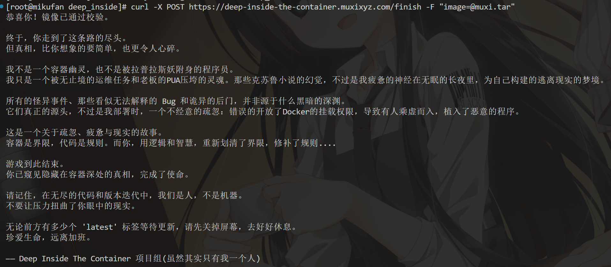
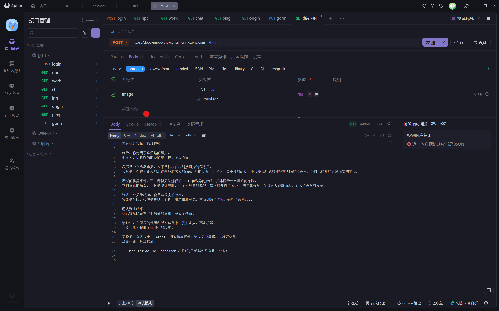

# Week7
## 小游戏
### 攻略笔记
1. docker run -d registry.cn-shenzhen.aliyuncs.com/muxi/deep-inside-the-container:latest
2. docker ps
3. docker exec -it [container id] /bin/bash
4. sudo ./start
// 输入姓名
5. cd triggerfs
6. ls
7. cat ./？？？.pem
8. cat 日记.txt
9. cat secret.txt
10. find / -name "bXV4aQ=="
11. cd /usr/lib/x86_64-linux-gnu/krb5/plugins/secret
12. cat README.txt
13. grep journal 'bXV4aQ=='
14. cd /opt/lib/b/X/V/4/a/Q/=/=/
15. ls
16. ./'==Qa4VXb'
17. cp /home/triggerfs/secret.pem /opt/lib/b/X/V/4/a/Q/=/=/'bXV4aQ=='
18. lsof -i:23333 | ./'==Qa4VXb'
> `lsof`的结果传入可执行文件。
> 我卡了好一会儿。
19. vim tool.go
修改后代码
```go
func quickSort(a []int) []int {
        if len(a) <= 1 {
                return a
        }
        pivot := a[0]
        left, right := []int{}, []int{}
        for _, v := range a[1:] {
                if v < pivot {
                        left = append(left, v)
                } else {
                        right = append(right, v)
                }
        }
        return append(append(quickSort(left), pivot), quickSort(right)...)
}
```
1.  ./'==Qa4VXb' --check
2.  export bXV4aQ="bXV4aQ="
> 这里很坑人，因为`muxi`的`base64`编码(`bXV4aQ==`)的结尾是`=`
> 导致设置环境变量键值的时候需要另外注意。
> PS：我是看源码才明白要这么设置的。
1.  ls
2.  将目录下的`deep-inside-container-C.tar`,`docker-compose.yaml`拷走到宿主机操作。
3.  修改`docker-compose.yaml`
```yaml
version: '3.8'
# TODO 让服务A运行在8080端口上，A和B需要在同一个网络，访问A以寻求你想要的
services:
  service_a:
    image: registry.cn-shenzhen.aliyuncs.com/muxi/deep-inside-the-container:A
    container_name: service_a_container
    ports: 
      - "8080:8080" # 映射端口到宿主机
    networks:
      - internal_network

  service_b:
    image: registry.cn-shenzhen.aliyuncs.com/muxi/deep-inside-the-container:B
    container_name: service_b_container
    networks:
      - internal_network # 建立并配置子网
networks:
  internal_network:
    driver: bridge
```
25. 在所在的目录打开终端
26. docker-compose up -d
27. 访问`http://localhost:8080`
28. 在.tar文件目录下创建并编辑`Dockerfile`
```dockerfile
FROM deep-inside-the-container:C
# TODO 设置环境变量MUXI=MUXI,将/app/secret/muxi.txt移动到/muxi/muxi.txt

ENV MUXI=MUXI

RUN mkdir -p /muxi && \
    mv /app/secret/muxi.txt /muxi/muxi.txt
# journal 11月27日 ：
# 要离开了，如果有人看到这里一定会以为我是个疯子或者是瞥见了古神而丧失了理智，其实我也只是一个可怜虫罢了，完成这个dockerfile，把生成的镜像导出成tar，使用form发送到这个地址，参数是image：
# https://deep-inside-the-container.muxixyz.com/finish
# 在那里，我会告诉你一切。
CMD ["sh"]
```
29. docker load -i deep-inside-the-container-C.tar
30. docker save -o deep-inside-the-container-C.tar deep-inside-container:C
31. docker build -t [image_name]
32. docker save -o [image_file].tar [image_name]
33. - 在`wsl`，curl -X POST https://deep-inside-the-container.muxixyz.com/finish -F "image=@[image_file].tar"
    - 1. 在`apifox`，新建http接口；
    - 2. 选择**POST**方法，并填入网址（https://deep-inside-the-container.muxixyz.com/finish）
    - 3. 在`Body`的`form-data`,参数名填`image`，类型选择`file`，并上传文件
34. 恭喜通关。


### 源码及分析
#### 路径
container : `/tmp`

### 通关截图

