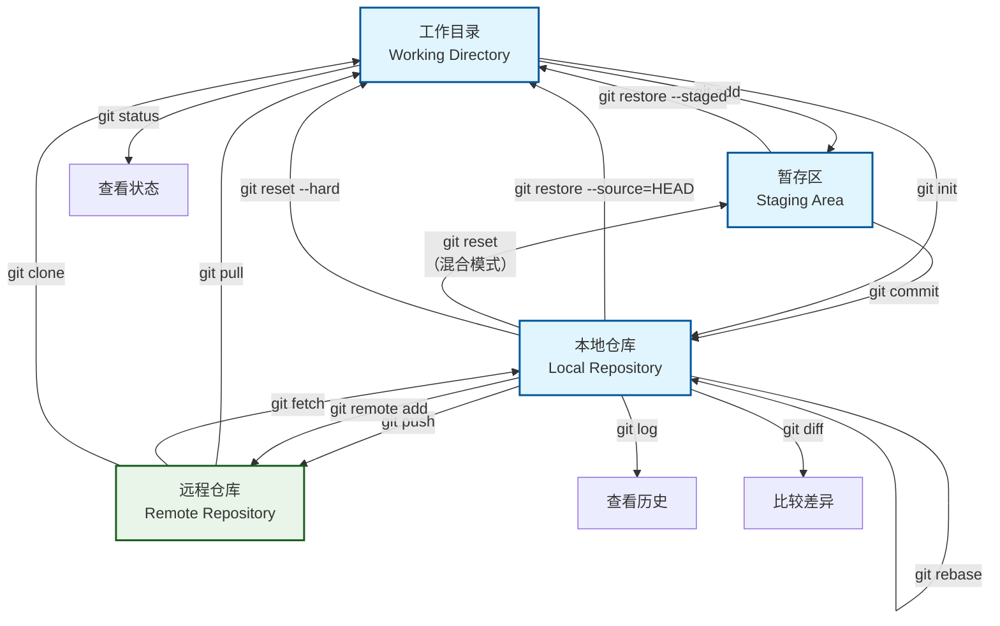

# 学习周记

## 在VS Code配置了Git仓库

通过**SSH**连接了Github仓库，公钥配置和passphrase好悬没给我干碎。
试试能不能用私钥在VS Code上传。

## 在VS Code安装了Markdown相关扩展

Markdown Preview Enhanced和Markdown All in One真的太方便了。

## 了解了Go数据结构知识

匿名成员变量、interface{}和闭包函数太好用了。只不过要我看代码了解实现有些难度。

flag 包未免有点太难懂了[^1]。

## Mermaid and Git

---
### Git 指令速查表

#### 基础配置
| 指令 | 说明 | 示例 |
|------|------|------|
| `git config --global user.name "姓名"` | 设置全局用户名 | `git config --global user.name "张三"` |
| `git config --global user.email "邮箱"` | 设置全局邮箱 | `git config --global user.email "zhangsan@email.com"` |
| `git config --list` | 查看所有配置 | `git config --list` |

#### 仓库操作
| 指令 | 说明 | 示例 |
|------|------|------|
| `git init` | 初始化新仓库 | `git init` |
| `git clone <url>` | 克隆远程仓库 | `git clone https://github.com/user/repo.git` |
| `git remote add <name> <url>` | 添加远程仓库 | `git remote add origin https://github.com/user/repo.git` |

#### 基本工作流
| 指令 | 说明 | 示例 |
|------|------|------|
| `git status` | 查看工作区状态 | `git status` |
| `git add <file>` | 添加文件到暂存区 | `git add .` (全部文件) `git add main.py` (单个文件) |
| `git commit -m "消息"` | 提交到本地仓库 | `git commit -m "修复登录bug"` |
| `git push <remote> <branch>` | 推送到远程仓库 | `git push origin main` |

#### 分支管理
| 指令                       | 说明      | 示例                          |
| ------------------------ | ------- | --------------------------- |
| `git branch`             | 查看分支列表  | `git branch`                |
| `git branch <name>`      | 创建新分支   | `git branch feature-login`  |
| `git switch <branch>`    | 切换分支    | `git switch main`           |
| `git switch -c <branch>` | 创建并切换分支 | `git switch -c hotfix-bug`  |
| `git merge <branch>`     | 合并分支    | `git merge feature-login`   |
| `git branch -d <branch>` | 删除分支    | `git branch -d feature-old` |

#### 查看与比较
| 指令 | 说明 | 示例 |
|------|------|------|
| `git log` | 查看提交历史 | `git log --oneline` (简洁模式) |
| `git diff` | 查看未暂存的修改 | `git diff` |
| `git diff --staged` | 查看已暂存的修改 | `git diff --staged` |
| `git show <commit>` | 查看特定提交详情 | `git show abc123` |

#### 撤销与回退
| 指令 | 说明 | 示例 |
|------|------|------|
| `git restore <file>` | 丢弃工作区修改 | `git restore main.py` |
| `git restore --staged <file>` | 从暂存区撤出文件 | `git restore --staged main.py` |
| `git reset <commit>` | 回退到指定提交(保留修改) | `git reset HEAD~1` |
| `git reset --hard <commit>` | 强制回退(丢弃所有修改) | `git reset --hard abc123` |
| `git revert <commit>` | 创建新的提交来撤销更改 | `git revert abc123` |

#### 暂存工作
| 指令 | 说明 | 示例 |
|------|------|------|
| `git stash` | 暂存当前工作 | `git stash` |
| `git stash list` | 查看暂存列表 | `git stash list` |
| `git stash pop` | 恢复最近暂存的工作 | `git stash pop` |

#### 标签管理
| 指令 | 说明 | 示例 |
|------|------|------|
| `git tag` | 查看标签列表 | `git tag` |
| `git tag <tagname>` | 创建轻量标签 | `git tag v1.0.0` |
| `git tag -a <tagname> -m "消息"` | 创建附注标签 | `git tag -a v1.0.0 -m "正式版"` |
| `git push origin <tagname>` | 推送标签到远程 | `git push origin v1.0.0` |

#### 高级操作
| 指令 | 说明 | 示例 |
|------|------|------|
| `git rebase <branch>` | 变基操作 | `git rebase main` |
| `git cherry-pick <commit>` | 选择特定提交 | `git cherry-pick abc123` |
| `git bisect` | 二分查找bug | `git bisect start` |

#### 常用选项说明
| 选项 | 说明 |
|------|------|
| `-m "消息"` | 添加提交消息 |
| `-a` | 自动暂存已跟踪文件的修改 |
| `--oneline` | 单行显示提交历史 |
| `--graph` | 图形化显示分支结构 |
| `-f` 或 `--force` | 强制操作 |
| `-v` 或 `--verbose` | 显示详细信息 |

## `gowork`, `gomod`, `gopath` and `goroot`
> `GOPATH` 和 `GOROOT` 属于旧的实现
> `gomod` 和 `gowork` 是新的Go modules依赖管理方法
### `GOPATH`and`GOROOT`
| 特性 | **GOPATH** | **GOROOT** |
| --- | --- |--- |
| **作用**           | Go工具链和标准库的安装目录。               | 用户开发和依赖管理的工作目录。 |
| **是否需要配置**   | 一般不需要手动配置（Go >= 1.8会自动设置）。 | 用户一般需要配置，或使用默认值 `$HOME/go`。|
| **内容**           | Go编译器、工具链、标准库源码及预编译文件。  | 用户代码、第三方包及编译生成的二进制文件。|
| **目录结构**       | 固定，包含`bin/`、`src/`、`pkg/`。          | 灵活，包含`bin/`、`src/`、`pkg/`。 |
| **开发者用途**     | 不直接用于开发，仅为工具链提供支持。         | 用于存放开发代码和依赖。 |

### `gomod` and `gowork`

| **特性** | **gomod** | **gowork**|
| --- | --- | --- |
| 场景 | 本地/线上开发 | 本地开发|
| 是否需要module名 | 是 | 否 |

gomod解决module互相依赖时，需要注意require的 \\indirect 库。
gomod处理第三方库，需要用require引入。
gowork要使用use指令，如果要用本地package路径更换url，需要用
$\fbox{replace( example.com/example/package\quad=> \quad./example/package)}$
更换路径。

---
#### 遇到的困难
没有接触到实际的开发项目，不太能明白module依赖管理的不同方式和必要性。

[^1]:[ .flag包](https://pkg.go.dev/flag)