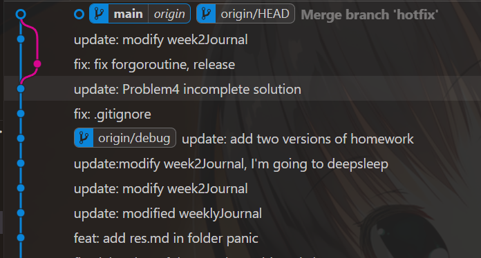

# 哈嗨嗨，第二周开始了
## `并行` 和 `并发` 的差别
> Copilot大人，太伟大了

| **特性**             | **并行 (Parallelism)**                          | **并发 (Concurrency)**       |
|----------------------|------------------------------------------------|------------------------------------------------|
| **定义** | 同一时间点执行多个任务    | 任务在同一时间段交替执行，未必同时运行   |
| **关注点**| 同时执行多个任务的能力    | 高效地管理多个任务的能力  |
| **核心思想** | 做更多的事（同时执行） | 看起来在同时做很多事（交替切换） |
| **依赖**  | 需要多核/多处理器支持   | 不需要多核，单核即可实现    |
| **实现方式**         | 任务独立运行在不同的处理器或核心上             | 通过时间片轮转或异步方式交替执行任务           |
| **示例**| 启动多个线程同时对数据进行计算  | 单线程中通过I/O多路复用处理多个网络连接  |
| **适用场景**| 计算密集型任务，如矩阵运算或图像处理 | I/O密集型任务，如服务器处理多个客户端请求      |
| **硬件需求**  | 依赖多核CPU或多处理器         | 不依赖特定硬件，单核也能实现                   |
| **同步性**     | 各任务通常独立运行，无需频繁交互     | 各任务可能需要频繁交互或同步    |

> 才发现看云上的《the way to go》比Github上少了好多章节

## **埃式筛**的go routine实现
``` go
// the way to go
// sieve.go

// Copyright 2009 The Go Authors. All rights reserved.
// Use of this source code is governed by a BSD-style
// license that can be found in the LICENSE file.package main
package main

import "fmt"

// Send the sequence 2, 3, 4, ... to channel 'ch'.
func generate(ch chan int) {
	for i := 2; ; i++ {
		ch <- i // Send 'i' to channel 'ch'.
	}
}

// Copy the values from channel 'in' to channel 'out',
// removing those divisible by 'prime'.
func filter(in, out chan int, prime int) {
	for {
		i := <-in // Receive value of new variable 'i' from 'in'.
		if i%prime != 0 {
			out <- i // Send 'i' to channel 'out'.
		}
	}
}

// The prime sieve: Daisy-chain filter processes together.
func main() {
	ch := make(chan int) // Create a new channel.
	go generate(ch)      // Start generate() as a goroutine.
	for {
		prime := <-ch
		fmt.Print(prime, " ")
		ch1 := make(chan int)
		go filter(ch, ch1, prime)
		ch = ch1
	}
}
```
并发开启多个`filter goroutine`，每个数要经过`filter`链才能被确定为**质数**。


| 时间点| filter链长度| 能正确筛除的合数范围 |
| --- | :-: | :--|
开始时 |0  | 只能识别2
发现2后| 1  | 能筛2的倍数（4,6,8...）
发现3后|2 | 能筛2,3的倍数（4,6,8,9,12...）  
发现5后| 3 | 能筛2,3,5的倍数（最大到25）
发现7后| 4 | 能筛2,3,5,7的倍数（最大到49）

`Alternative`
``` go
// the way to go
// sieve2.go

// Copyright 2009 The Go Authors. All rights reserved.
// Use of this source code is governed by a BSD-style
// license that can be found in the LICENSE file.

package main

import (
	"fmt"
)

// Send the sequence 2, 3, 4, ... to returned channel
func generate() chan int {
	ch := make(chan int)
	go func() {
		for i := 2; ; i++ {
			ch <- i
		}
	}()
	return ch
}

// Filter out input values divisible by 'prime', send rest to returned channel
func filter(in chan int, prime int) chan int {
	out := make(chan int)
	go func() {
		for {
			if i := <-in; i%prime != 0 {
				out <- i
			}
		}
	}()
	return out
}

func sieve() chan int {
	out := make(chan int)
	go func() {
		ch := generate()
		for {
			prime := <-ch
			ch = filter(ch, prime)
			out <- prime
		}
	}()
	return out
}

func main() {
	primes := sieve()
	for {
		fmt.Println(<-primes)
	}
}
```
## Go `Slice`, `Map`内存扩容的区别

### `Slice`

常见初始化方式
``` go
s := make([]type, length, capacity) // optional length and capacity
// 若无len，默认为0
// 若有len，无cap，默认len = cap
// 可以使用len(), cap()获取切片的length, capacity
```

**内存扩容**
- 当向 Slice 添加元素，且它的长度（`len`）超过当前容量（`cap`）时，Go 运行时会创建一个更大的底层数组并将现有元素复制到新数组中。
- 新数组的容量通常是现有容量的 **2 倍**，但在容量较大时，增长可能会小于 2 倍。
> 扩容2倍是实际开发中，平衡节省空间和利用性能的惯用数值。

**扩容代价**
- **复制成本**：扩容时会进行一次数据复制，成本与现有数组的大小成正比。
- **内存分配成本**：需要分配新的内存空间。
- 扩容后，原来的底层数组会被垃圾回收（如果没有其他引用）。

### `Map`

Map 是 Go 语言中的哈希表实现，扩容机制与 Slice 不同，它是基于哈希桶（`bucket`）的动态扩展。

**内存扩容**
- Map 的底层由多个哈希桶组成，每个桶中存储一定数量的键值对。
- 当哈希桶的负载因子（`load factor`）超过一定阈值时，Map 会触发扩容。
- 扩容时，Map 会增加桶的数量（通常是原来的 2 倍），并将现有的键值对重新分配到新的桶中。

**扩容代价**
- **重新哈希成本**：需要将现有的键值对重新计算哈希值并分配到新的桶。
- **内存分配成本**：需要分配新的哈希桶。

| 特性                | Slice                           | Map                        |
|---------------------|---------------------------------|----------------------------|
| **触发条件**        | 长度超过容量                   | 负载因子超过阈值           |
| **扩容倍数**        | 通常是 2 倍，较灵活            | 通常是 2 倍                |
| **实现方式**        | 创建新数组并复制数据           | 增加桶并重新分配键值对      |
| **扩容成本**        | 数据复制成本较高，但简单        | 重新哈希和分配成本较高      |
| **特定场景优化**    | 适合顺序添加数据              | 适合随机访问和插入数据      |

## sync.Waitgroup
可以等待所有goroutine运行结束，再进行后续操作。
## 主线P4
channel增加缓冲区，可以减少堵塞，并能作为存储数据的空间。
## Happy Branching & Merging


---

终于**没捅娄子**地使用branch & merge了。